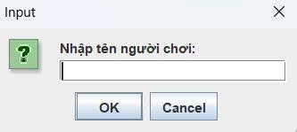
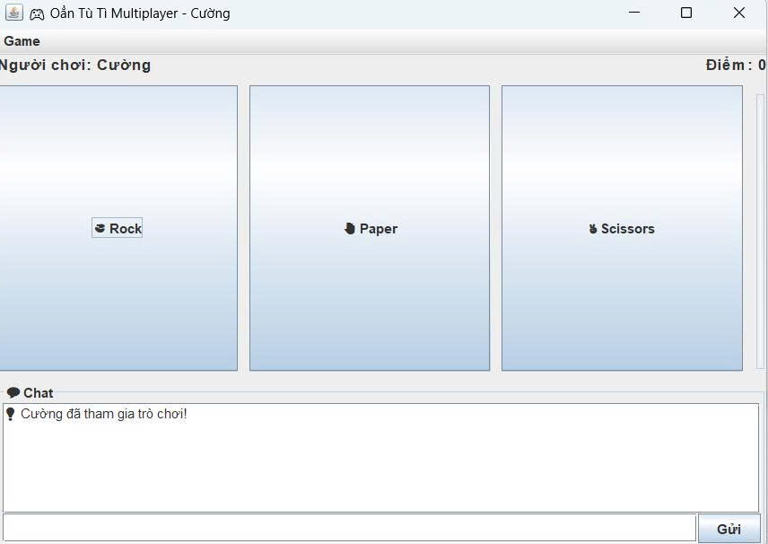
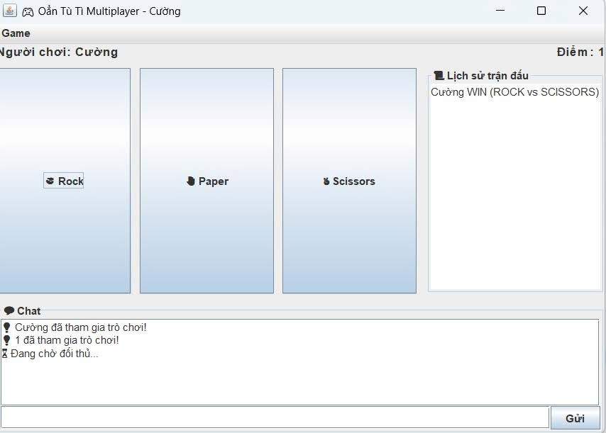

<h2 align="center">
    <a href="https://dainam.edu.vn/vi/khoa-cong-nghe-thong-tin">
    🎓 Faculty of Information Technology (DaiNam University)
    </a>
</h2>
<h2 align="center">
   QUẢN LÝ SÁCH - THƯ VIỆN QUA MẠNG
</h2>

    

        
        
        
    

## 📑 Table of Contents
1. [Giới thiệu](#-giới-thiệu)
2. [Tính năng chính](#-tính-năng-chính)
3. [Công nghệ sử dụng](#-công-nghệ-sử-dụng)
4. [Hình ảnh giao diện](#-hình-ảnh-giao-diện)
5. [Hướng dẫn cài đặt & chạy](#-hướng-dẫn-cài-đặt--chạy)
6. [Liên hệ](#-liên-hệ)

---

## 📖 Giới thiệu
Dự án **Trò chơi Oẳn Tù Tì qua mạng** giúp sinh viên vận dụng kiến thức lập trình mạng, xây dựng ứng dụng **Client/Server** với **TCP Socket**, cho phép nhiều người chơi tham gia và chơi theo thời gian thực.  

Ứng dụng gồm:
- **Server**: Quản lý kết nối, ghép cặp người chơi, xử lý kết quả, broadcast kết quả.  
- **Client**: GUI Swing cho phép người chơi chọn nước đi, chat, xem lịch sử và điểm số.

---

## 🎯 Tính năng chính
- Kết nối nhiều client cùng lúc.  
- Chọn nước đi: **Búa – Kéo – Bao**.  
- Chat trực tuyến giữa các người chơi.  
- Hiển thị lịch sử trận đấu.  
- Hiển thị điểm cá nhân và **Leaderboard**.  
- Reset điểm và lịch sử dễ dàng từ menu.

---

## 🔧 Công nghệ sử dụng
| Công nghệ        | Mục đích                                                        |
|-----------------|-----------------------------------------------------------------|
| Java             | Lập trình mạng, multithreading, Swing GUI                      |
| TCP Socket       | Kết nối client-server tin cậy                                    |
| Multithreading   | Xử lý nhiều client đồng thời                                     |
| Java I/O         | Truyền dữ liệu và lưu kết quả vào file                          |
| GUI Swing        | Hiển thị giao diện trực quan                                     |
| IDE              | IntelliJ IDEA / Eclipse / NetBeans để biên dịch và debug         |

---

## 🚀 Hình ảnh giao diện
### 1. Đăng nhập

" width="400" />

**Giao diện đăng nhập** – Người chơi nhập username.

### 2. Gameplay

" width="500" />

**Giao diện trò chơi chính** – Chọn nước đi và xem lịch sử trận đấu.

### 3. Kết quả & lịch sử

" width="500" />

**Hiển thị kết quả và lịch sử chơi** – Điểm số và kết quả trận đấu.

---

## ⚙️ ** Các bước cài đặt**     

🛠️ 1. Yêu cầu hệ thống    

☕ Java Development Kit (JDK): Phiên bản 8+ (khuyến nghị JDK 11 hoặc 17)     

💻 Hệ điều hành: Windows, macOS, hoặc Linux    

🖥️ Môi trường phát triển: IDE (IntelliJ IDEA, Eclipse, NetBeans) hoặc terminal   

📡 Kết nối mạng: LAN hoặc Internet nếu muốn nhiều máy chơi cùng nhau   

💾 Bộ nhớ: ≥ 4GB RAM, dung lượng trống tối thiểu 500MB   

📥 2. Các bước cài đặt     
🧰 Bước 1: Chuẩn bị môi trường     

- Cài đặt Java    

- Yêu cầu JDK 8 trở lên (JDK 21 vẫn chạy tốt).    

- Kiểm tra bằng lệnh:       

      java -version   
      javac -version  

- Nếu cả hai hiển thị version ≥ 8 là hợp lệ.  

- Cấu trúc thư mục dự án:      

    └── src/             
      ├── client/     # Code giao diện & xử lý phía Client              
      ├── server/     # Code xử lý Server & quản lý phòng chơi       

🏗 Bước 2: Biên dịch mã nguồn   

- Mở terminal và điều hướng đến thư mục dự án:   

      cd D:\Download\LTM-1604-D09-OTT-TCP\src   

▶️ Bước 3: Chạy ứng dụng    

- Khởi động Server   
- java server.GameServer   
- Server sẽ chạy trên port mặc định 12345 (có thể chỉnh trong code).   
- Console hiển thị:   
- GameServer running on port 12345     
- Khởi động Client     
- java client.GameClient     
- Mỗi client mở 1 terminal hoặc chạy nhiều lần từ IDE.     
- Khi vào, nhập Tên người chơi + IP Server + Port.     
- Ví dụ: nhập 127.0.0.1 nếu client và server chạy cùng máy.    
🚀 Cách Chơi     
- nhập tên người chơi khi mở Client.      
- Tạo phòng / Tham gia phòng: chọn ngẫu nhiên hoặc nhập ID phòng.      
- Gameplay:      
    ✊ Búa thắng ✌️ Kéo       
    ✋ Bao thắng ✊ Búa      
    ✌️ Kéo thắng ✋ Bao       
- Kết quả: hiển thị ngay sau khi cả 2 chọn xong.      
- Sau trận:      
- Chọn Play Again để chơi tiếp.     
- Chọn Leave để thoát phòng.
- 
- ## 📬 ** Liên hệ**
- **Sinh viên thực hiện:** **Nguyễn Mạnh Cường**
- **Khoa công nghệ thông tin – Đại học Đại Nam**  
- 🌐 Website: [https://dainam.edu.vn/vi/khoa-cong-nghe-thong-tin](https://dainam.edu.vn/vi/khoa-cong-nghe-thong-tin)  
- 📧 Email: [nmcuong13122004@gmail.com]
- 📱 Fanpage: [AIoTLab - FIT DNU](https://www.facebook.com/DNUAIoTLab)  
